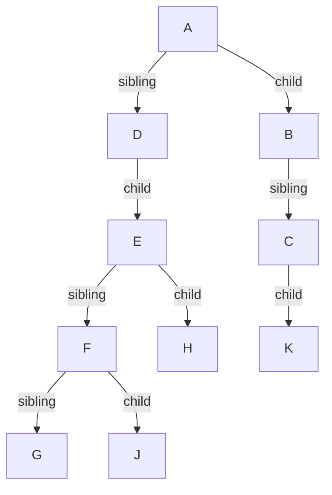

```mermaid
flowchart 
    id1["A"]
    id2["D"]
    id3["E"]
    id4["F"]
    id5["G"]
    id4 -- sibling --> id5 
    id6["J"]
    id4 -- child --> id6 
    id3 -- sibling --> id4 
    id7["H"]
    id3 -- child --> id7 
    id2 -- child --> id3 
    id1 -- sibling --> id2 
    id8["B"]
    id9["C"]
    id10["K"]
    id9 -- child --> id10 
    id8 -- sibling --> id9 
    id1 -- child --> id8 

```

