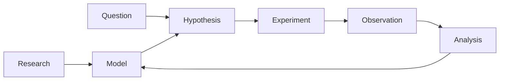
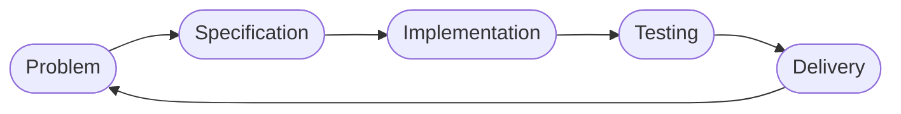
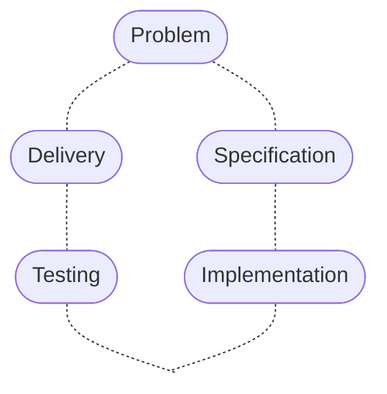
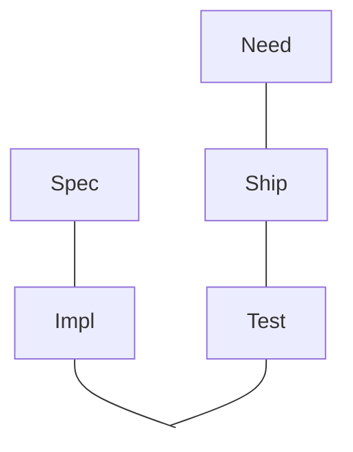
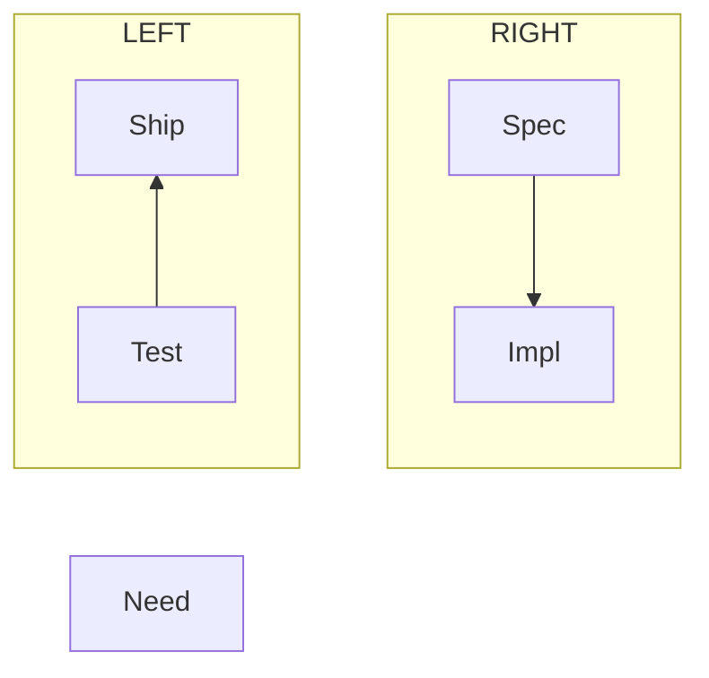

## Talk outline

* Developer humor
* Software Delivery Cycle
* Debugging Philosophies
* The scientific method
* Observation and Analysis
* Tools

---

## Scientific Method




---
layout: quote
---

# What is the shortest lie in software development?

<v-click>

## "It works"

</v-click>

<v-click at=3>

(Almost no software ships with all features complete and no bugs.)

</v-click>

<v-click>

## "Done!"

</v-click>

<v-click at=4>

(Success with customers usually means you are never "done.")

</v-click>

---

# Software Delivery Cycle



---
layout: quote
disabled: true
---


"Most people would rather die than think and many of them do!"
<br/>
-- Bertrand Russell


---
layout: center
---

# Debugging philosophies

---
layout: two-cols-header
clicks: 3
---

<v-click at='1'>

<center>

## They're both right!

</center>

</v-click>

<v-click at='2'>

<div style="text-align: right">

Cannot fix mistakes in mental model without making *observations*.

</div>

Cannot efficiently search for bugs without *thinking systematically*.


</v-click>


::left::


"A debugger is no substitute for thinking."
<br/> 
-- John Guttag (paraphrased)


<v-click at='3'>

(actual quote: "There is no substitute for reading your code
...
People are often resistant to that.
They'd rather single step through it ..., than just read it and try and figure things out.")

</v-click>

::right::


"Stop thinking, and look!"
<br/>
-- Dave Agans

---
layout: two-cols
clicks: 8
---

# Binary Search

<<< @/bin_search.rs#bsearch_inf_loop rust {|2,3|5|7,8|9,10|12|}

::right::

# &nbsp;

<div class="flex flex-col items-center">
  <div v-if="$clicks === 0">
    Explaining
  </div>
  <div v-if="$clicks === 1">
    Initially looking at whole slice from A to B
  </div>
  <div v-if="$clicks === 2">
    Identify middle element of current slice
  </div>
  <div v-if="$clicks === 3">
    If we found the record with matching K, return it
  </div>
  <div v-if="$clicks === 4">
    If midpoint too big, then focus on left side
  </div>
  <div v-if="$clicks === 5">
    If midpoint too small, then focus on right side
  </div>
  <div v-if="$clicks >= 6" class="left">
    Unfortunately, it is busted

  </div>
  <div v-if="$clicks >= 6" class="left">

<<< bin_search.rs#demo_data rust

</div>
  <div v-if="$clicks >= 7">
<<< bin_search.rs#demo2 rust
  </div>
  <div v-if="$clicks >= 7">

This works as expected; returns `Some((2, "two"))`.

But...
  </div>

  <div v-if="$clicks >= 8">


<<< bin_search.rs#demo3 rust
 </div>
 <div v-if="$clicks >= 8">

... this second one does not work; it infinite loops.

</div>

</div>

---
layout: center
---

# Lets add some debug logging

---
layout: two-cols
clicks: 3
---

<<< @/bin_search.rs#bsearch_debug_logs rust {|2,3,9|}

::right::


<div v-if="$clicks >= 2">

`bsearch(&demo, 2)` prints:
```
haystack: [1, 2, 4, 5, 6, 9] needle: 2
A M B
0 3 6
0 1 3
```

</div>
<div v-if="$clicks >= 3">

`bsearch(&demo, 3)` prints:
```
haystack: [1, 2, 4, 5, 6, 9] needle: 3
A M B
0 3 6
0 1 3
1 2 3
1 1 2
1 1 2
1 1 2
...
```

</div>

---
layout: center
---

# The quick fix!

"It must just be an off-by-one error"

---
layout: two-cols
clicks: 3
---

# Quick hack

<<< @/bin_search.rs#incorrect_fix rust {13,15}

::right::

Old code kept reconsidering same range repeatedly.

Cursory inspection: "Lets update the places where `mid` is used to compute new endpoints."

<div v-if="$clicks >= 1">

## **Warning: *incorrect* fix!**

(Challenge for those who know correct fix: Why is arguing for symmetry inapplicable here?)

</div>

---
layout: two-cols
clicks: 4
---

# "It works"

<<< @/bin_search.rs#incorrect_fix rust

::right::

<<< bin_search.rs#demo_data rust

<div v-if="$clicks == 2">

`bsearch(&demo, 2)` prints:
```
haystack: [1, 2, 4, 5, 6, 9] needle: 2
A M B
0 3 6
0 1 2
```

and returns `Some((2,"two"))`

</div>

<div v-if="$clicks == 3">

`bsearch(&demo, 3)` prints:
```
haystack: [1, 2, 4, 5, 6, 9] needle: 3
A M B
0 3 6
0 1 2
```

and returns `None`.

(So far, so good.)

</div>

<div v-if="$clicks >= 4">

But its not good.

`bsearch(&demo, 1)` prints:
```
haystack: [1, 2, 4, 5, 6, 9] needle: 1
A M B
0 3 6
0 1 2
```

and returns `None`.

* Do we really understand what's going on?
* Are these print statements enlightening us?

</div>


---
layout: two-cols
clicks: 3
---

# Binary Search

<<< @/bin_search.rs#incorrect_fix rust {|15|13|13,15}

::right::

## Imprecision in Mental Model

We have a set of candidate elements, denoted by a half-open range $[A,B)$

(meaning element at $A$ is included as a candidate, while element at $B$ is excluded
as a candidate).

<div v-if="$clicks == 1">
  
 Here, we are going from $[A,B)$ to $[M+1,B)$; element at $M$ is excluded from future consideration (fixing infinite loop from earlier).
 
 This makes sense; we have already proven element at M to be too small.

</div>

<div v-if="$clicks == 2">

. . .

  Here, we are going from $[A,B)$ to $[A,M-1)$; element at $M-1$ is excluded from future consideration. This is *not* justified; we have not proven anything about element at $M-1$.

</div>

<div v-if="$clicks >= 3">

. . .

. . .

The two cases are *not* symmetric. A half-open range means that the left end-point should be treated differently than the the right endpoint.

(Thought experiment: What does the code look like if one uses closed ranges $[A,B]$ to encode the search bounds?)

</div>

---

<CircleGraph :titles="[
  'Analyze Requirement',
  'Design Solution',
  'Implement',
  'Test',
  'Deploy',
  'Maintain'
]" />


---

<script setup>
import { ref, onMounted } from 'vue'

const dynamicData = ref([])

onMounted(() => {
  // Generate or fetch your data programmatically
  dynamicData.value = generateData()
})

function generateData() {
  return [...Array(5)].map((_, i) => ({
    id: i,
    title: `Dynamic Item ${i}`,
    value: Math.random() * 100
  }))
}
</script>

# My Dynamic Slide

<div v-for="item in dynamicData" :key="item.id">
  {{ item.title }}: {{ item.value.toFixed(2) }}
</div>


---
layout: two-cols
clicks: 0
---

<!-- set clicks above to a positive number (e.g. 5) to resume having expected click behvior on this slide. -->


<style>
.highlighted-problem #Problem { fill: #ff9900 !important; stroke: #ff6600 !important; stroke-width: 2px !important; }
.highlighted-spec #Spec { fill: #ff9900 !important; stroke: #ff6600 !important; stroke-width: 2px !important; }
.highlighted-impl #Impl { fill: #ff9900 !important; stroke: #ff6600 !important; stroke-width: 2px !important; }
.highlighted-test #Test { fill: #ff9900 !important; stroke: #ff6600 !important; stroke-width: 2px !important; }
.highlighted-delivery #Delivery { fill: #ff9900 !important; stroke: #ff6600 !important; stroke-width: 2px !important; }
</style>

<div :class="{ 'highlighted-problem': $clicks === 1, 'highlighted-spec': $clicks === 2, 'highlighted-impl': $clicks === 3, 'highlighted-test': $clicks === 4, 'highlighted-delivery': $clicks === 5 }">

</div>


::right::

here is some text

<div>
  <div v-if="$clicks === 1">
    <p>Discussing the problem...</p>
i  </div>
  <div v-else-if="$clicks === 2">
    <p>Creating the specification...</p>
  </div>
  <div v-else-if="$clicks === 3">
    <p>Implementing the solution...</p>
  </div>
  <div v-else-if="$clicks === 4">
    <p>Testing our implementation...</p>
  </div>
  <div v-else-if="$clicks === 5">
    <p>Delivering the product...</p>
  </div>
</div>
  
---

<svg>
 <g transform="translate(50,50)">
  <rect width=60 height=40 rx=20 ry=20 fill="white" class="black1" />
  <text class="middle_text">Spec</text>
</g>
</svg>

---



---



---


---

Hello World

<svg xmlns="http://www.w3.org/2000/svg" width="500" height="150" viewBox="0 0 500 150" style="background-color: white;">
  <style>
  .black1 { stroke: black; stroke-width: 1 }
  .sibling {
    stroke: orange; stroke-width: 1; fill: none;
  }
  .child {
    stroke: blue; stroke-width: 1; fill: none;
  }
  .middle_text {
    text-anchor: middle; dominant-baseline: middle
  }
  </style>
  <!-- Links -->
  <!-- Sibling links (horizontal) -->
  <path d="M 70 75 L 170 75" class="sibling" />
  <path d="M 170 75 L 270 75" class="sibling" />
  <path d="M 70 125 L 170 125" class="sibling" />
  <path d="M 170 125 L 270 125" class="sibling" />
  
  <!-- Child links -->
  <path d="M 40 75 L 40 100 L 70 125" class="child" />
  <path d="M 170 75 L 170 125" class="child" />
  <path d="M 270 75 L 270 100 L 370 125" class="child" />
  
  <!-- Nodes -->
  <!-- First row -->
  <g transform="translate(40, 75)">
    <circle r="15" fill="white" class="black1" />
    <text class="middle_text">A</text>
  </g>
  
  <g transform="translate(75, 75)">
    <circle r="15" fill="white" class="black1" />
    <text class="middle_text">B</text>
  </g>

  <g transform="translate(170, 75)">
    <circle r="15" fill="white" class="black1" />
    <text class="middle_text">C</text>
  </g>
  
  <g transform="translate(270, 75)">
    <circle r="15" fill="white" class="black1" />
    <text class="middle_text">D</text>
  </g>
  
  <!-- Second row -->
  <g transform="translate(70, 125)">
    <circle r="15" fill="white" class="black1" />
    <text class="middle_text">E</text>
  </g>
  
  <g transform="translate(170, 125)">
    <circle r="15" fill="white" class="black1" />
    <text class="middle_text">F</text>
  </g>

  <g transform="translate(270, 125)">
    <circle r="15" fill="white" class="black1" />
    <text class="middle_text">G</text>
  </g>
  
  <g transform="translate(370, 125)">
    <circle r="15" fill="white" class="black1" />
    <text class="middle_text">H</text>
  </g>
</svg>

Helow

---
src: ./deeper.naive_svg.xml
---

---
src: ./sect_2_3_2.naive_svg.xml
---

---
---

Ji 0


---

Ji 1

<<< ./tree1.svg xml

---

Ji 2

<<< ./tree1.svg xml

---

Ji

---
src: guide.md
---
