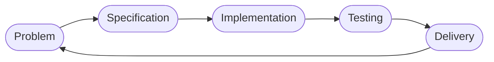
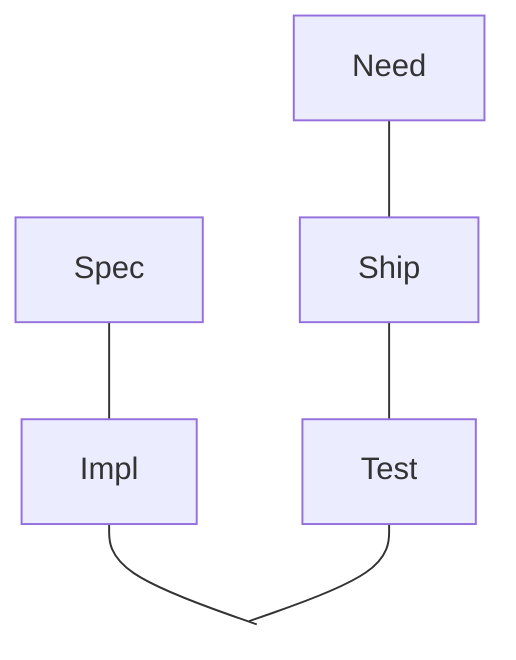
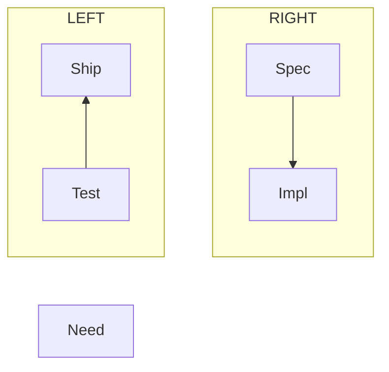

## Talk outline

* Developer humor
* Software delivery cycle
* Schools of thought on debugging
* The scientific method
* Zooming in on observation and analysis
* Tools

---

---
layout: two-cols
clicks: 5
---

::right::

here is some text

  

    
Discussing the problem...

  

  

    
Creating the specification...

  

  

    
Implementing the solution...

  

  

    
Testing our implementation...

  

  

    
Delivering the product...

  

---

<svg>
 <g transform="translate(50,50)">
  <rect width=60 height=40 rx=20 ry=20 fill="white" class="black1" />
  <text class="middle_text">Spec</text>
</g>
</svg>

---

---

---

---

Hello World

<svg xmlns="http://www.w3.org/2000/svg" width="500" height="150" viewBox="0 0 500 150" style="background-color: white;">
  
  <!-- Links -->
  <!-- Sibling links (horizontal) -->
  <path d="M 70 75 L 170 75" class="sibling" />
  <path d="M 170 75 L 270 75" class="sibling" />
  <path d="M 70 125 L 170 125" class="sibling" />
  <path d="M 170 125 L 270 125" class="sibling" />
  
  <!-- Child links -->
  <path d="M 40 75 L 40 100 L 70 125" class="child" />
  <path d="M 170 75 L 170 125" class="child" />
  <path d="M 270 75 L 270 100 L 370 125" class="child" />
  
  <!-- Nodes -->
  <!-- First row -->
  <g transform="translate(40, 75)">
    <circle r="15" fill="white" class="black1" />
    <text class="middle_text">A</text>
  </g>
  
  <g transform="translate(75, 75)">
    <circle r="15" fill="white" class="black1" />
    <text class="middle_text">B</text>
  </g>

  <g transform="translate(170, 75)">
    <circle r="15" fill="white" class="black1" />
    <text class="middle_text">C</text>
  </g>
  
  <g transform="translate(270, 75)">
    <circle r="15" fill="white" class="black1" />
    <text class="middle_text">D</text>
  </g>
  
  <!-- Second row -->
  <g transform="translate(70, 125)">
    <circle r="15" fill="white" class="black1" />
    <text class="middle_text">E</text>
  </g>
  
  <g transform="translate(170, 125)">
    <circle r="15" fill="white" class="black1" />
    <text class="middle_text">F</text>
  </g>

  <g transform="translate(270, 125)">
    <circle r="15" fill="white" class="black1" />
    <text class="middle_text">G</text>
  </g>
  
  <g transform="translate(370, 125)">
    <circle r="15" fill="white" class="black1" />
    <text class="middle_text">H</text>
  </g>
</svg>

Helow

---
src: ./deeper.naive_svg.xml
---

---
src: ./sect_2_3_2.naive_svg.xml
---

---
---

Ji 0

---

Ji 1

<<< ./tree1.svg xml

---

Ji 2

<<< ./tree1.svg xml

---

Ji

---
src: guide.md
---
